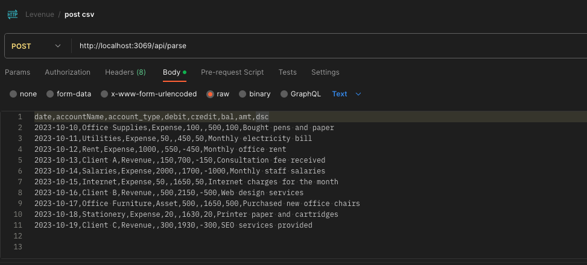
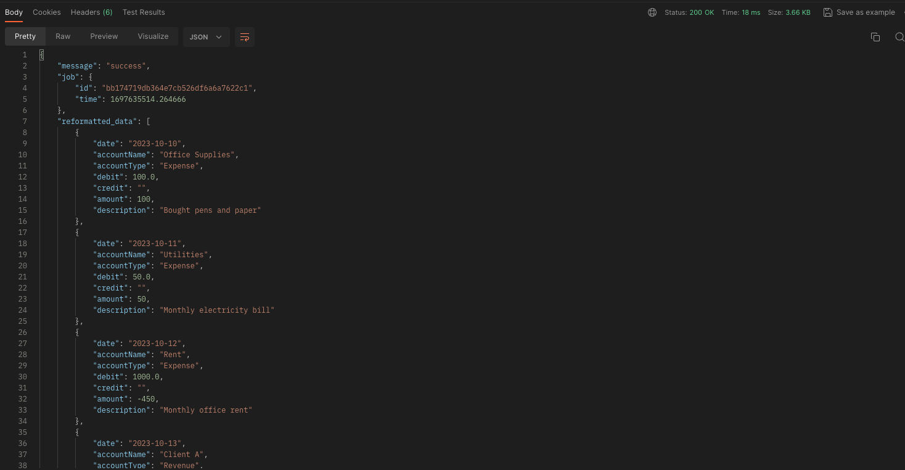

## General Ledger Parser API

API that takes a csv and maps it to predefined column names.

uses Logistic Regression on the column names to try predict the closest match to the internal column names.

to run:

```bash
python3 api.py
```

### How to use:

It will host an api on `127.0.0.1:3069`

You can use the `postman.json` file to load the postman config.

example data:

```csv
date,accountName,account_type,debit,credit,bal,amt,dsc
2023-10-10,Office Supplies,Expense,100,,500,100,Bought pens and paper
2023-10-11,Utilities,Expense,50,,450,50,Monthly electricity bill
2023-10-12,Rent,Expense,1000,,550,-450,Monthly office rent
2023-10-13,Client A,Revenue,,150,700,-150,Consultation fee received
2023-10-14,Salaries,Expense,2000,,1700,-1000,Monthly staff salaries
2023-10-15,Internet,Expense,50,,1650,50,Internet charges for the month
2023-10-16,Client B,Revenue,,500,2150,-500,Web design services
2023-10-17,Office Furniture,Asset,500,,1650,500,Purchased new office chairs
2023-10-18,Stationery,Expense,20,,1630,20,Printer paper and cartridges
2023-10-19,Client C,Revenue,,300,1930,-300,SEO services provided
```

and output:

```json
{
  "message": "success",
  "job": {
    "id": "bdcd4407d2e44b5baf2a4b6422d89ac3",
    "time": 1697634901.375492
  },
  "reformatted_data": [
    {
      "date": "2023-10-10",
      "accountName": "Office Supplies",
      "accountType": "Expense",
      "debit": 100.0,
      "credit": "",
      "amount": 100,
      "description": "Bought pens and paper"
    },
    {
      "date": "2023-10-11",
      "accountName": "Utilities",
      "accountType": "Expense",
      "debit": 50.0,
      "credit": "",
      "amount": 50,
      "description": "Monthly electricity bill"
    },
    {
      "date": "2023-10-12",
      "accountName": "Rent",
      "accountType": "Expense",
      "debit": 1000.0,
      "credit": "",
      "amount": -450,
      "description": "Monthly office rent"
    },
    {
      "date": "2023-10-13",
      "accountName": "Client A",
      "accountType": "Revenue",
      "debit": "",
      "credit": 150.0,
      "amount": -150,
      "description": "Consultation fee received"
    },
    {
      "date": "2023-10-14",
      "accountName": "Salaries",
      "accountType": "Expense",
      "debit": 2000.0,
      "credit": "",
      "amount": -1000,
      "description": "Monthly staff salaries"
    },
    {
      "date": "2023-10-15",
      "accountName": "Internet",
      "accountType": "Expense",
      "debit": 50.0,
      "credit": "",
      "amount": 50,
      "description": "Internet charges for the month"
    },
    {
      "date": "2023-10-16",
      "accountName": "Client B",
      "accountType": "Revenue",
      "debit": "",
      "credit": 500.0,
      "amount": -500,
      "description": "Web design services"
    },
    {
      "date": "2023-10-17",
      "accountName": "Office Furniture",
      "accountType": "Asset",
      "debit": 500.0,
      "credit": "",
      "amount": 500,
      "description": "Purchased new office chairs"
    },
    {
      "date": "2023-10-18",
      "accountName": "Stationery",
      "accountType": "Expense",
      "debit": 20.0,
      "credit": "",
      "amount": 20,
      "description": "Printer paper and cartridges"
    },
    {
      "date": "2023-10-19",
      "accountName": "Client C",
      "accountType": "Revenue",
      "debit": "",
      "credit": 300.0,
      "amount": -300,
      "description": "SEO services provided"
    }
  ],
  "predictions": {
    "predictions": [
      {
        "col_name": "date",
        "prediction": "date",
        "confidence": 90.033,
        "probabilities": {
          "accountName": 0.432,
          "accountNumber": 0.299,
          "accountType": 0.528,
          "amount": 3.0,
          "balance": 1.009,
          "credit": 1.279,
          "date": 90.033,
          "debit": 1.691,
          "description": 1.727
        }
      },
      {
        "col_name": "accountName",
        "prediction": "accountName",
        "confidence": 94.247,
        "probabilities": {
          "accountName": 94.247,
          "accountNumber": 1.701,
          "accountType": 1.172,
          "amount": 1.353,
          "balance": 0.46,
          "credit": 0.233,
          "date": 0.325,
          "debit": 0.166,
          "description": 0.344
        }
      },
      {
        "col_name": "account_type",
        "prediction": "accountType",
        "confidence": 80.383,
        "probabilities": {
          "accountName": 6.271,
          "accountNumber": 3.852,
          "accountType": 80.383,
          "amount": 2.761,
          "balance": 1.008,
          "credit": 1.316,
          "date": 1.63,
          "debit": 1.008,
          "description": 1.77
        }
      },
      {
        "col_name": "debit",
        "prediction": "debit",
        "confidence": 87.29,
        "probabilities": {
          "accountName": 0.301,
          "accountNumber": 0.436,
          "accountType": 0.54,
          "amount": 2.498,
          "balance": 0.972,
          "credit": 2.298,
          "date": 2.636,
          "debit": 87.29,
          "description": 3.03
        }
      },
      {
        "col_name": "credit",
        "prediction": "credit",
        "confidence": 88.651,
        "probabilities": {
          "accountName": 0.37,
          "accountNumber": 0.486,
          "accountType": 0.621,
          "amount": 1.657,
          "balance": 0.773,
          "credit": 88.651,
          "date": 1.986,
          "debit": 2.407,
          "description": 3.049
        }
      },
      {
        "col_name": "bal",
        "prediction": "amount",
        "confidence": 34.074,
        "probabilities": {
          "accountName": 1.52,
          "accountNumber": 1.59,
          "accountType": 1.61,
          "amount": 34.074,
          "balance": 24.468,
          "credit": 4.264,
          "date": 11.798,
          "debit": 8.896,
          "description": 11.781
        }
      },
      {
        "col_name": "amt",
        "prediction": "amount",
        "confidence": 88.298,
        "probabilities": {
          "accountName": 0.828,
          "accountNumber": 0.378,
          "accountType": 0.545,
          "amount": 88.298,
          "balance": 1.259,
          "credit": 1.309,
          "date": 3.358,
          "debit": 1.74,
          "description": 2.286
        }
      },
      {
        "col_name": "dsc",
        "prediction": "description",
        "confidence": 77.096,
        "probabilities": {
          "accountName": 0.778,
          "accountNumber": 0.755,
          "accountType": 0.996,
          "amount": 6.523,
          "balance": 2.016,
          "credit": 3.278,
          "date": 5.415,
          "debit": 3.144,
          "description": 77.096
        }
      }
    ]
  }
}
```

## Images

<p align="center">
  
</p>

<p align="center">
  
</p>
